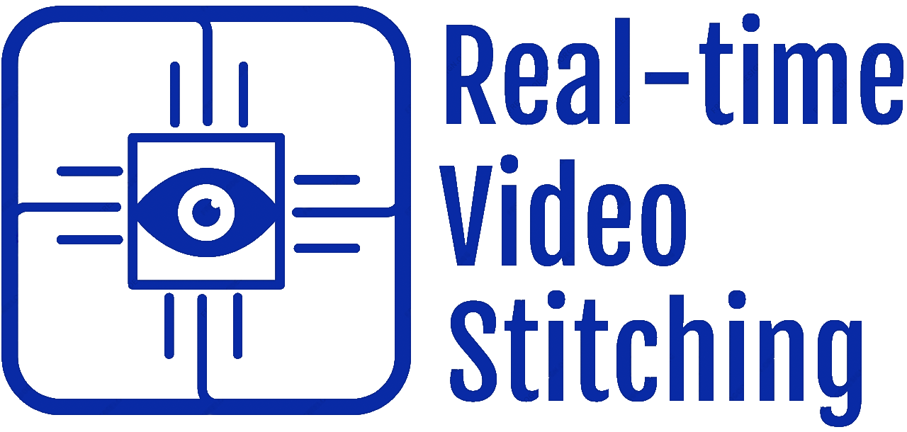

[![Contributors][contributors-shield]][contributors-url]
[![Forks][forks-shield]][forks-url]
[![Stargazers][stars-shield]][stars-url]
[![Issues][issues-shield]][issues-url]
[![MIT License][license-shield]][license-url]
[![LinkedIn][linkedin-shield]][linkedin-url]


<!-- PROJECT LOGO -->
<br />
<p align="center">
  <a href="https://github.com/AugustinJose1221/FPGA-Build">
    
  </a>

  <h3 align="center">FPGA Architecture for Real-time Video Stitching</h3>

  <p align="center">
    A novel architectural design for stitching video streams in real-time on an FPGA.
    <br />
    <a href="https://github.com/othneildrew/Best-README-Template"><strong>Explore the docs »</strong></a>
    <br />
    <br />
  </p>
</p>


<!-- TABLE OF CONTENTS -->
<details open="open">
  <summary>Table of Contents</summary>
  <ol>
    <li>
      <a href="#about-the-project">About The Project</a>
       <ul>
        <li><a href="#algorithm">Algorithm</a></li>
        <li><a href="#top-level-design">Top Level Design</a></li>
      </ul>
    </li>
    <li>
      <a href="#getting-started">Getting Started</a>
      <ul>
        <li><a href="#prerequisites">Prerequisites</a></li>
        <li><a href="#installation">Installation</a></li>
      </ul>
    </li>
    <li><a href="#usage">Usage</a></li>
    <li><a href="#roadmap">Roadmap</a></li>
    <li><a href="#contributing">Contributing</a></li>
    <li><a href="#license">License</a></li>
    <li><a href="#contact">Contact</a></li>
  </ol>
</details>


<!-- ABOUT THE PROJECT -->
## About The Project
The designed architecture generates a video having a wider feild of view by stitching two video input based on features and keypoints. In simple terms, the output generated will be a panorama but with video. The architecture is optimized such that the output can be produced in real-time.

### Algorithm
The figure below illustrates the block diagram of the system depicting each step of the algorithm.
 


The system can be broadly divided into three subystems:
* Preprocessing
* SIFT Based Feature Extraction
* Frame Stitching

#### Preprocessing

The  input  video  stream  for  the  system  is  in  8  bit  RGB format. The input 8 bit image is shown in figure. Each  individual  frame  of  the  video  stream  will  have three  channels  corresponding  to  red,  green  and  blue.  The colour  information  in  the  video  frames  does  not  enhance feature  detection.  Moreover,  computation  on  a  3  channel  8 bit image takes more time compared to a single channel 8 bit image. Therefore, the RGB video frame is converted to an 8 bit grayscale image. The generated grayscale images will have lesser noise, more details in the shadows and provides better computational efficiency, shown in figure. 

|  |  |
|:---:|:---:|
| Input image | Grayscale image |

#### SIFT Based Feature Extraction

Feature extraction from the grayscale images is done using SIFT  algorithm.  SIFT  algorithm  can  be  separated  into  two main steps:
* Keypoint Detection

  SIFT operation begins with discrete convolution of the input image with different Gaussian filters. A Gaussian filter is a widely used image smoothing algorithm defined as:
  <p align="center">
      
  </p>
  In the above equation,  G  is  the  Gaussian  kernel  at  the  point  (x,  y) and σ is  the  Gaussian  parameter. Using a larger  value  of σ produces a greater smoothing  effect  on  the  image.  Discrete  convolution of  the  image  with  Gaussian  kernel  generates  an  image  with lesser  noise  and  lesser  details.  In  SIFT,  discrete  convolution with Gaussian kernel is done with four different values of σ. Progressively  higher  values  of σ is  used  to  generate  a  set  of blurred images or an octave. 
|  |  |  |  |  |
|:---:|:---:|:---:|:---:|:---:|
| Input image | Sigma = 1.6 | Sigma = 2.26 | Sigma = 3.2 | Sigma = 4.5 |

  For a given value of σ, the sum of all coefficients in the convolution kernal should be equal to unity. Therefore, the size of the kernal increases as the value of σ increases. 

  Once the octave is generated,  a  DoG  space  is  built  based on the four images in the octave. DoG stands for difference of Gaussian.  DoG is a very computationally efficient approximation of Laplacian of Gaussian (LoG). The DoG space is built by  computing  the  difference  between  two  adjacent  Gaussian scale images, pixel by pixel. DoG space of four images in the octave will have three levels. 
|  |  |  |
|:---:|:---:|:---:|
| Top level DoG | Middle level DoG | Bottom level DoG |

  Keypoints  are  extracted  from  the  DoG  space  by  finding the  local  maxima  or  minima  values.  A  pixel  is  considered a keypoint if it is a local maxima or minima within a 26 pixel neighbourhood consisting of 9 pixels in the top level, 8 pixels in the middle level and 9 pixels in the bottom level.
  <p align = "center">
   <br>
  Keypoints
  </p>
  
  |  |  |  |
|:---:|:---:|:---:|
| Keypoints using OpenCV sift function | Keypoints using SIFT implementation in Python | Keypoint generated by the FPGA design |
  * Descriptor Generation

  Keypoint descriptor is a unique identifier  for  a  particular  keypoint.  SIFT  uses  gradient  magnitude  and  direction  of  the  keypoint  as  the  basis  for  the descriptor.  Gradient  magnitude  and  direction  at  a  point  can be calculated by discrete convolution of the image with Sobel filters. 
  <p align = "center">
   <br>
  Sobel convolution output
  </p>
  To generate the keypoint descriptor, gradient magnitude and direction  of  every  point  inside  a  16x16  window  around  each keypoint is calculated. The gradient magnitudes of the 16x16 window  is  convolved  with  a  Gaussian  kernel.  The  gradient magnitudes in every 4x4 cell is combined such that the 16x16 window is reduced to a 4x4 window and 16 gradient directions. Finally, these 16 gradient directions are transferred into eight bins.  Hence  a  128  element  vector  is  built  which  acts  as  the keypoint descriptor.
  
#### Frame Stitching

Frame stitching is the process of combining two frames into a single image. Frame stitching is done in two steps:
* Keypoint Matching

  The  keypoint  descriptors  of  keypoints  in  the  video  frames  from  both  camera  sensors  are compared.  If  the  difference  between  the  keypoint  descriptors of  two  keypoints,  one  from  each  camera  sensor,  is  below  a error  threshold,  then  they  are considered  as  a  keypoint  pair.  The keypoint pair with the least difference between their keypoint descriptors is taken as the reference keypoints.  
  |  |  |
  |:---:|:---:|
  | Input image from left camera | Input image from right camera |
* Image Blending

  A  weighed  average  method  is  used to  blend  the  two  frames  into  a  single  image. The  values  of  pixels  in  the  overlapped  region  is  equal to  the  weighted  average  values  of  pixels  of  both  the  frames. The  weights  are  chosen  based  on  the  distance  between  the overlapped  pixel  and  the  border  of  the  corresponding  frame.
  <p align = "center">
   <br>
  Stitched image
  </p>
### Top Level Design
The block schematic of the architecture from top level is shown in figure below.
<p align = "center">
   <br>
  Block Schematic
</p>
  
 The top level design is divided into five stages: 
 * [Preprocessing stage](https://github.com/AugustinJose1221/FPGA-Build/blob/beta/design/README.md#preprocessing-stage)
 * [Filter stage](https://github.com/AugustinJose1221/FPGA-Build/blob/beta/design/README.md#filter-stage)
 * [Keypoint stage](https://github.com/AugustinJose1221/FPGA-Build/blob/beta/design/README.md#keypoint-stage)
 * [Keypoint matching stage](https://github.com/AugustinJose1221/FPGA-Build/blob/beta/design/README.md#keypoint-matching-stage)
 * [Frame blending stage](https://github.com/AugustinJose1221/FPGA-Build/blob/beta/design/README.md#frame-blending-stage)
 
 
<!-- GETTING STARTED -->
## Getting Started
### Prerequisites
The following packages needs to be installed on the Linux system before executing the source code.
* Icarus Verilog
  ```sh
  apt-get install iverilog
  ```
  
* Python
  ```sh
  apt-get install python3
  ```

* OpenCV
  ```sh
  pip3 install opencv-contrib-python
  ```
* numpy
  ```sh
  pip3 install numpy
  ```
  
* PIL (Python Image Library)
  ```sh
  pip3 install pillow
  ```

### Installation

1. Clone the repo
   ```sh
   git clone https://github.com/AugustinJose1221/FPGA-Build.git
   ```
2. Change working directory
   ```sh
   cd FPGA-Build/make
   ```
3. Compile the design
   ```sh
   make create
   ```
4. To view the RTL waveform
   ```sh
   make simulate
   ```
5. Generate output image
   ```sh
   python3 hexToImage.py
   ```
<!-- USAGE EXAMPLES -->
## Usage
### Project Tree
 * [Templates](./Templates)
   * [controller_tb.vcd](./Templates/controller_tb.vcd)
   * [controller.v](./Templates/controller.v)
   * [slave_1_tb.v](./Templates/slave_1_tb.v)
   * [slave_1_tb.vcd](./Templates/slave_1_tb.vcd)
   * [slave_1.v](./Templates/slave_1.v)
   * [controller_tb.v](./Templates/controller_tb.v)
   * [Makefile](./Templates/Makefile)
   * [README.md](./Templates/README.md)
   * [filter.v](./Templates/filter.v)
   * [gaussian.v](./Templates/gaussian.v)
 * [vcd](./vcd)
   * [BRWM_tb.vcd](./vcd/BRWM_tb.vcd)
   * [README.md](./vcd/README.md)
   * [filter5x5.vcd](./vcd/filter5x5.vcd)
   * [image.vcd](./vcd/image.vcd)
   * [video_stitcher_tb.vcd](./vcd/video_stitcher_tb.vcd)
   * [interface_tb.vcd](./vcd/interface_tb.vcd)
 * [design](./design)
   * [README.md](./design/README.md)
   * [Controller.v](./design/Controller.v)
   * [matcher.v](./design/matcher.v)
   * [display.v](./design/display.v)
   * [camera.v](./design/camera.v)
   * [descriptor.v](./design/descriptor.v)
   * [filter5x5.v](./design/filter5x5.v)
   * [Grayscaler.v](./design/Grayscaler.v)
   * [image.v](./design/image.v)
   * [image2.v](./design/image2.v)
   * [keypoints.v](./design/keypoints.v)
   * [RWM_1.v](./design/RWM_1.v)
   * [RWM_2.v](./design/RWM_2.v)
   * [sobel_filter.v](./design/sobel_filter.v)
   * [stitcher.v](./design/stitcher.v)
 * [res](./res)
   * [CV2SIFT.jpg](./res/CV2SIFT.jpg)
   * [DIFF1.jpg](./res/DIFF1.jpg)
   * [DIFF2.jpg](./res/DIFF2.jpg)
   * [DIFF3.jpg](./res/DIFF3.jpg)
   * [data1.txt](./res/data1.txt)
   * [data2.txt](./res/data2.txt)
   * [data.txt](./res/data.txt)
   * [FilterOut3.jpg](./res/FilterOut3.jpg)
   * [FILTEROUT3.jpg](./res/FILTEROUT3.jpg)
   * [FilterOut5.jpg](./res/FilterOut5.jpg)
   * [FILTEROUT5.jpg](./res/FILTEROUT5.jpg)
   * [FILTEROUT6.jpg](./res/FILTEROUT6.jpg)
   * [FilterOut7.jpg](./res/FilterOut7.jpg)
   * [FILTEROUT7.jpg](./res/FILTEROUT7.jpg)
   * [FilterOut9.jpg](./res/FilterOut9.jpg)
   * [Final1.jpg](./res/Final1.jpg)
   * [Final2.jpg](./res/Final2.jpg)
   * [Final.jpg](./res/Final.jpg)
   * [Grayscale-Out.jpg](./res/Grayscale-Out.jpg)
   * [KEYPOINTS1.jpg](./res/KEYPOINTS1.jpg)
   * [KEYPOINTS2.jpg](./res/KEYPOINTS2.jpg)
   * [KEYPOINTS3.jpg](./res/KEYPOINTS3.jpg)
   * [KEYPOINTS4.jpg](./res/KEYPOINTS4.jpg)
   * [KEYPOINTS5.jpg](./res/KEYPOINTS5.jpg)
   * [KEYPOINTS6.jpg](./res/KEYPOINTS6.jpg)
   * [OUT1.jpg](./res/OUT1.jpg)
   * [OUT2.jpg](./res/OUT2.jpg)
   * [Out.jpg](./res/Out.jpg)
   * [OUT.jpg](./res/OUT.jpg)
   * [random.jpg](./res/random.jpg)
   * [sift.py](./res/sift.py)
   * [SIGMA_1_6.jpg](./res/SIGMA_1_6.jpg)
   * [SIGMA_2_26.jpg](./res/SIGMA_2_26.jpg)
   * [SIGMA_3_2.jpg](./res/SIGMA_3_2.jpg)
   * [SIGMA_4_5.jpg](./res/SIGMA_4_5.jpg)
   * [SUBKEYPOINTS1.jpg](./res/SUBKEYPOINTS1.jpg)
   * [left.jpg](./res/left.jpg)
   * [left.txt](./res/left.txt)
   * [right.jpg](./res/right.jpg)
   * [right.txt](./res/right.txt)
   * [SOBEL1.jpg](./res/SOBEL1.jpg)
   * [SOBEL.jpg](./res/SOBEL.jpg)
   * [SOBEL_X.jpg](./res/SOBEL_X.jpg)
   * [SOBEL_Y.jpg](./res/SOBEL_Y.jpg)
   * [imageToHex.py](./res/imageToHex.py)
   * [STITCH1.jpg](./res/STITCH1.jpg)
   * [out.txt](./res/out.txt)
   * [hexToImage.py](./res/hexToImage.py)
 * [make](./make)
   * [Makefile](./make/Makefile)
 * [outfiles](./outfiles)
   * [display](./outfiles/display)
   * [FILTER](./outfiles/FILTER)
   * [Gaussian](./outfiles/Gaussian)
   * [image](./outfiles/image)
   * [interface](./outfiles/interface)
   * [output.bin](./outfiles/output.bin)
 * [testbenches](./testbenches)
   * [BRWM_tb.v](./testbenches/BRWM_tb.v)
   * [README.md](./testbenches/README.md)
   * [video_stitcher_tb.v](./testbenches/video_stitcher_tb.v)
   * [interface_tb.v](./testbenches/interface_tb.v)
   * [top_tb.v](./testbenches/top_tb.v)
   * [display_tb.v](./testbenches/display_tb.v)
   * [filter5x5_tb.v](./testbenches/filter5x5_tb.v)
   * [image_tb.v](./testbenches/image_tb.v)
   * [interface.v](./testbenches/interface.v)
   * [top.v](./testbenches/top.v)
 * [img](./img)
   * [System Design.jpg](./img/System%20Design.jpg)
   * [Final1.jpg](./img/Final1.jpg)
   * [OUT2.jpg](./img/OUT2.jpg)
 * [README.md](./README.md)
 * [tree.sh](./tree.sh)


<!-- ROADMAP -->
## Roadmap

See the [open issues](https://github.com/AugustinJose1221/FPGA-Build/issues) for a list of proposed features (and known issues).


<!-- CONTRIBUTING -->
## Contributing
Any contributions you make are **greatly appreciated**.

1. Fork the Project
2. Create your Feature Branch (`git checkout -b feature/AmazingFeature`)
3. Commit your Changes (`git commit -m 'Add some AmazingFeature'`)
4. Push to the Branch (`git push origin feature/AmazingFeature`)
5. Open a Pull Request


<!-- LICENSE -->
## License

Distributed under the MIT License. See `LICENSE` for more information.


<!-- CONTACT -->
## Contact

Twitter: [@augustinjose121](https://twitter.com/augustinjose121) <br>
Gmail: [augustinjose1221@gmail..com](https://mail.google.com/mail/?view=cm&fs=1&to=augustinjose1221@gmail.com) <br>
Discuss: [Github Discussions](https://github.com/AugustinJose1221/FPGA-Build/discussions) <br>


<!-- MARKDOWN LINKS & IMAGES -->
<!-- https://www.markdownguide.org/basic-syntax/#reference-style-links -->
[contributors-shield]: https://img.shields.io/github/contributors/AugustinJose1221/FPGA-Build.svg?style=for-the-badge
[contributors-url]: https://github.com/AugustinJose1221/FPGA-Build/graphs/contributors
[forks-shield]: https://img.shields.io/github/forks/AugustinJose1221/FPGA-Build.svg?style=for-the-badge
[forks-url]: https://github.com/AugustinJose1221/FPGA-Build/network/members
[stars-shield]: https://img.shields.io/github/stars/AugustinJose1221/FPGA-Build.svg?style=for-the-badge
[stars-url]: https://github.com/AugustinJose1221/FPGA-Build/stargazers
[issues-shield]: https://img.shields.io/github/issues/AugustinJose1221/FPGA-Build.svg?style=for-the-badge
[issues-url]: https://github.com/AugustinJose1221/FPGA-Build/issues
[license-shield]: https://img.shields.io/github/license/AugustinJose1221/FPGA-Build.svg?style=for-the-badge
[license-url]: https://github.com/AugustinJose1221/FPGA-Build/blob/master/LICENSE.txt
[linkedin-shield]: https://img.shields.io/badge/-LinkedIn-black.svg?style=for-the-badge&logo=linkedin&colorB=555
[linkedin-url]: https://linkedin.com/in/augustin-jose1221
[product-screenshot]: images/screenshot.png
